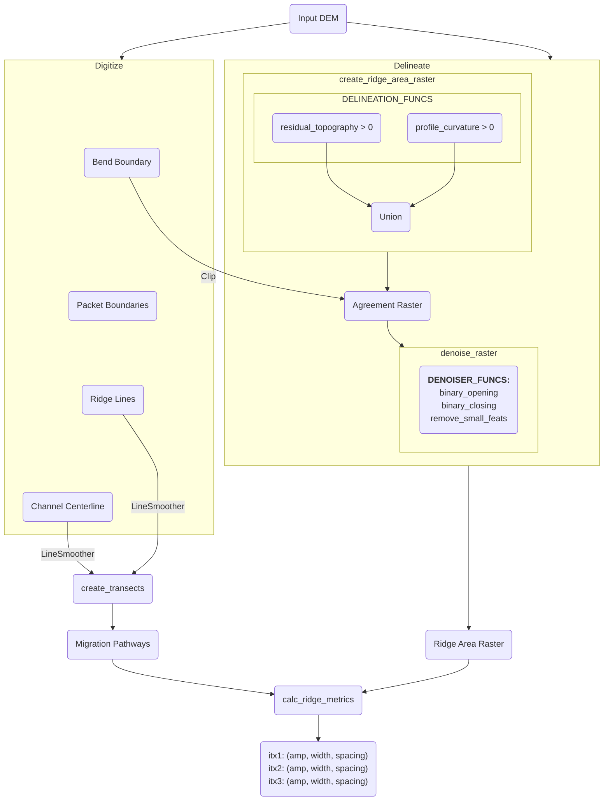

# Overview

## 1. Project Structure

```
scrollstats/
├── docs/                                  # Project documentation published to https://scrollstats.readthedocs.io
│   └── conf.py                            # Configuration for documentation building with Sphinx
├── example_data/                          # Example datasets used in docs/ and tests/
├── img/                                   # Images referenced in docs/
├── paper/                                 # Contents for accompanying JOSS paper
│   ├── figs/                              # Figures for JOSS paper
│   ├── paper.bib                          # Bibliography for JOSS paper
│   └── paper.md                           # JOSS paper
├── scripts/                               # Auxiliary scripts using scrollstats
│   ├── plots/                             # Scripts to generate plots referenced in docs/
│   ├── calc_ridge_metrics.py              # Example script to calculate ridge metrics
│   ├── create_vector_data.py              # Example script to create vector data
│   └── delineate_ridge_area_raster.py     # Example script to delineate ridge area rasters
├── src/                                   # Source code for scrollstats
│   └── scrollstats/                       # Top level folder for sub-packages
│       ├── delineation/                   # Contains code for delineating ridges from DEM
│       │   ├── array_types.py             # Type definitions for numpy arrays
│       │   ├── line_smoother.py           # Smoothing code for manually digitized features
│       │   ├── raster_classifiers.py      # Classifies ridge areas within DEM
│       │   ├── raster_denoisers.py        # De-noises raw ridge area rasters
│       │   └── ridge_area_raster.py       # Entry point to create ridge area raster
│       ├── ridge_metrics/                 # Contains code to calculate ridge area metrics
│       │   ├── calc_ridge_metrics.py      # Entry point to calculate ridge area metrics
│       │   ├── data_extractors.py         # DataExtractor classes to calculate metrics at Bend, Transect, and Ridge scales
│       │   └── ridge_amplitude.py         # Ridge amplitude calculation
│       └── transecting/                   # Contains code to generate transects
│           └── transect.py                # Entry point to generate transects
├── tests/                                 # Contains test code
│   ├── test_core.py                       # Unit tests for scrollstats functionality
│   └── test_package.py                    # Unit tests for package version
├── ARCHITECTURE.md                        # This document
├── LICENSE                                # Project license file
├── noxfile.py                             # Configuration for local development and testing with nox
├── pyproject.toml                         # Project configuration and dependency declaration
└── README.md                              # Project overview and quickstart guide
```

## 2. High-Level Diagram


## 3. Core Components

### 3.1. Delineation


### 3.2. Transecting
### 3.3. Ridge Metrics

## 4. Data Stores

The example dataset used in project docs and tests is included in the
[example_data/input](example_data/input/) folder.

No other external data is used.

## 5. External Integrations / APIs

## 6. Deployment and Infrastructure

## 7. Security Considerations

## 8. Development & Testing

## 9. Future Considerations

## 10. Project Identification

## 11. Glossary / Acronyms
