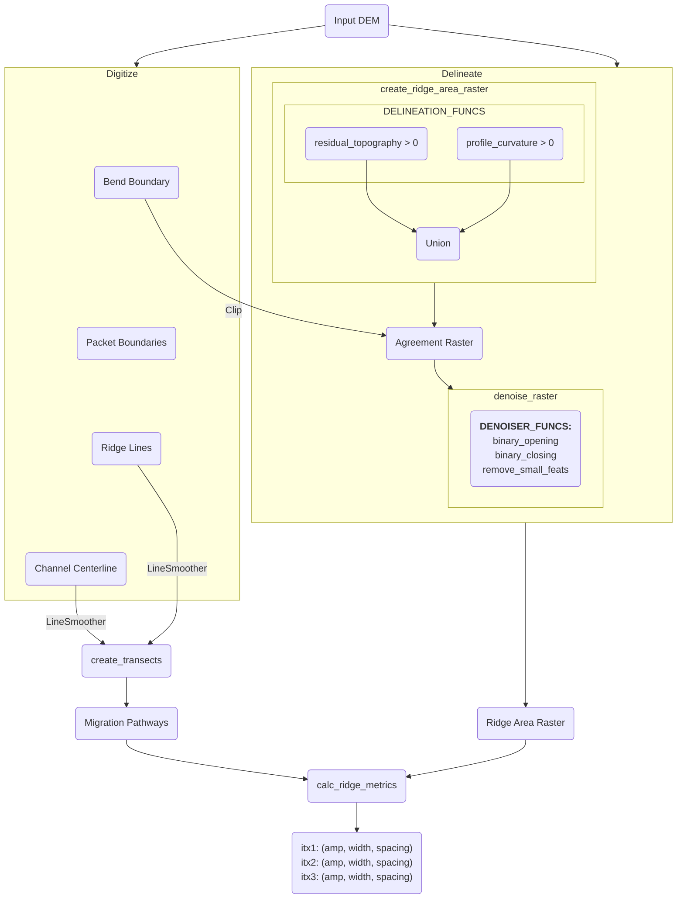

# Overview

## 1. Project Structure

```
scrollstats/
├── docs/                                  # Project documentation published to https://scrollstats.readthedocs.io
│   └── conf.py                            # Configuration for documentation building with Sphinx
├── example_data/                          # Example datasets used in docs/ and tests/
├── img/                                   # Images referenced in docs/
├── paper/                                 # Contents for accompanying JOSS paper
│   ├── figs/                              # Figures for JOSS paper
│   ├── paper.bib                          # Bibliography for JOSS paper
│   └── paper.md                           # JOSS paper
├── scripts/                               # Auxiliary scripts using scrollstats
│   ├── plots/                             # Scripts to generate plots referenced in docs/
│   ├── calc_ridge_metrics.py              # Example script to calculate ridge metrics
│   ├── create_vector_data.py              # Example script to create vector data
│   └── delineate_ridge_area_raster.py     # Example script to delineate ridge area rasters
├── src/                                   # Source code for scrollstats
│   └── scrollstats/                       # Top level folder for sub-packages
│       ├── delineation/                   # Contains code for delineating ridges from DEM
│       │   ├── array_types.py             # Type definitions for numpy arrays
│       │   ├── line_smoother.py           # Smoothing code for manually digitized features
│       │   ├── raster_classifiers.py      # Classifies ridge areas within DEM
│       │   ├── raster_denoisers.py        # De-noises raw ridge area rasters
│       │   └── ridge_area_raster.py       # Entry point to create ridge area raster
│       ├── ridge_metrics/                 # Contains code to calculate ridge area metrics
│       │   ├── calc_ridge_metrics.py      # Entry point to calculate ridge area metrics
│       │   ├── data_extractors.py         # DataExtractor classes to calculate metrics at Bend, Transect, and Ridge scales
│       │   └── ridge_amplitude.py         # Ridge amplitude calculation
│       └── transecting/                   # Contains code to generate transects
│           └── transect.py                # Entry point to generate transects
├── tests/                                 # Contains test code
│   ├── test_core.py                       # Unit tests for scrollstats functionality
│   └── test_package.py                    # Unit tests for package version
├── ARCHITECTURE.md                        # This document
├── LICENSE                                # Project license file
├── noxfile.py                             # Configuration for local development and testing with nox
├── pyproject.toml                         # Project configuration and dependency declaration
└── README.md                              # Project overview and quickstart guide
```

## 2. High-Level Diagram



## 3. Core Components

### 3.1. Delineation

This subpackage contains the code that's used to delineate ridge areas from the
DEM. It relies heavily on the `rasterio` and `numpy` libraries to accomplish
this.

`scrollstats.delineation.ridge_area_raster.create_ridge_area_raster()` is the
main entry point for raster delineation and makes use of the functions found in
the accompanying `raster_classifiers.py` and `raster_denoisers.py` modules.

<!-- blacken-docs:off -->

```python
def create_ridge_area_raster(
    dem_ds: rasterio.DatasetReader,
    geometry: Polygon,
    classifier_funcs: tuple[BinaryClassifierFn, ...] = DEFAULT_CLASSIFIERS,
    denoiser_funcs: tuple[BinaryDenoiserFn, ...] = DEFAULT_DENOISERS,
    no_data_value: Any | None = None,
    **kwargs: Any,
) -> tuple[np.ndarray, np.ndarray, dict[Any, Any]]:
```

<!-- blacken-docs:on -->

Raster classifier functions take a 2D numpy array of continuous data (like a
DEM) and return a binary 2D numpy array where values of 1 indicate the features
of interest, 0 is background, and `np.nan` is no data. Any number of classifier
functions are applied to the DEM in parallel then the union of all these binary
rasters are taken to result in what's called the Agreement Raster (where all
classifiers agree there is a ridge).

By default, `create_ridge_area_raster()` uses the 2 classifier functions
`profile_curvature_classifier()` and `residual_topography_classifier()` in the
tuple `DEFAULT_CLASSIFIERS` defined in the `raster_classifiers.py`.
`DEFAULT_CLASSIFIERS` is then imported into the `ridge_area_raster.py` and set
as the default value for the `classifier_funcs` argument in
`create_ridge_area_raster()`. The user may provide their own list of classifier
functions here too so long as all functions in the list follow the same
input/output pattern.

Denoiser functions are then applied to the Agreement Raster after it has been
clipped to the bend boundary Polygon. Denoiser functions take a binary 2D numpy
array and return a binary 2D numpy array. Denoiser functions are applied in
series on the clipped Agreement raster so that the output of the first is the
input of the second, and so on. This means that the order of denoiser funcs can
change the end result, unlike the classifier process from before.

By default, `create_ridge_area_raster()` uses the 3 denoiser functions
`scipy.ndimage.binary_closing()`, `scipy.ndimage.binary_opening()`, and
`remove_small_feats_w_flip()` in the tuple `DEFAULT_DENOISERS` defined in the
`raster_denoisers.py`. `DEFAULT_DENOISERS` is then imported into
`ridge_area_raster.py` and set as the default value for the `denoiser_funcs`
argument in `create_ridge_area_raster()`. The user may provide their own list of
denoiser functions here too so long as all functions in the list follow the same
input/output pattern.

Any new classifier or denoiser functions just need to be added to the respective
modules and follow the established input/output patterns, then they too can be
imported and used in `create_ridge_area_raster()`.

### 3.2. Transecting

### 3.3. Ridge Metrics

## 4. Data Stores

The example dataset used in project docs and tests is included in the
[example_data/input](example_data/input/) folder.

No other external data is used.

## 5. External Integrations / APIs

No external integrations / APIs are used.

## 6. Deployment and Infrastructure

All CI/CD is ran through GitHub Actions. ScollStats is distributed to PyPI (for
download with `pip`) and on conda-forge (for download with `conda`).

Docs are built and hosted on
[readthedocs.io](https://scrollstats.readthedocs.io/en/latest/).

## 7. Security Considerations

ScrollStats is configured with
[Trusted Publishing](https://docs.pypi.org/trusted-publishers/) to distribute
releases to PyPI.

## 8. Development & Testing

See [README](README.md) for steps to get started developing with ScrollStats.

Once your development environment is set up, use
[`nox`](https://nox.thea.codes/en/stable/) for local development and testing.
See [noxfile.py](noxfile.py) for configuration details. Once you are happy with
your commits, simply run the command

```
nox
```

to lint and test your edits all in their own virtual environment.

## 9. Future Considerations

See the project [roadmap](https://github.com/users/a-vanderheiden/projects/5)
for current work in progress and future considerations.

## 10. Project Identification

**Project Name:** ScrollStats

**Repository URL:** https://github.com/tamu-edu/scrollstats

**Primary Contact/Team:** Andrew Vanderheiden | andrewloyd19@gmail.com

## 11. Glossary / Acronyms

RST: Ridge and Swale Topography

DEM: Digital Elevation Model

H74: referencing the paper
[The Development of Meanders in Natural River-Channels (Hickin 1974)](https://doi.org/10.2475/ajs.274.4.414)
