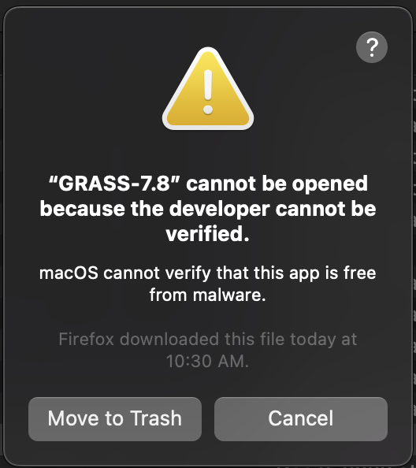

# ScrollStats

An open-source python library to calculate and extract morphometrics from scrollbar floodplains.


# Getting Started

### Create conda environment

Create a conda environment from the provided `environment.yml` file with the following commands
```shell
# Navigate to this directory
cd path/to/scrollstats

# Create the environment
conda env create -f environment.yml
```

### Install GRASS GIS

To install GRASS GIS, visit the [GRASS GIS download page](https://grass.osgeo.org/download/mac/) and download the latest version of GRASS 7 available. 

ScrollStats was developed with GRASS 7.* and major changes were introduced in GRASS 8.*. Compatibility with GRASS 8 is one of the near term goals for future scrollstats development. 

You will have to "authorize" GRASS on MacOS before running it. Otherwise, MacOS will treat it as malicious software. See the note "Authorize GRASS GIS on MacOS" below for assistance.

# Using ScrollStats

ScrollStats uses interactive jupyter notebooks as the user interface, however the underlying [scripting library](scrollstats) can also be used on its own. Example usage of ScrollStats has been broken up in the three following notebooks:
- [DelineateRidgeAreas.ipynb](DelineateRidgeAreas.ipynb)
- [CreateVectorDatasets.ipynb](CreateVectorDatasets.ipynb)
- [CalculateRidgeMetrics.ipynb](CalculateRidgeMetrics.ipynb)

These three notebooks all include detailed instruction on the intended use of the ScrollStats library with an included [example dataset](example_data) of a bend from the Lower Brazos River, TX. Once you are comfortable using the library from the notebooks, feel free to edit the code or make your own scripts to suit your needs. 

The three notebooks above are written to process one bend at a time. However, all of these operations are designed to be easily incorporated into a `for` loop for batch processing of multiple bends, if desired.

[CompleteBendProcess.ipynb](CompleteBendProcess.ipynb) contains all of the processing steps in the three notebooks above without much annotation so that all processes for a bend can be completed at once. 


## The ScrollStats workflow

**1. Set geoprocessing parameters**

- All geoprocessing parameters (such as window size) are kept in [parameters.py](parameters.py). Set all the parameters to the desired values before running any scripts. 

**2. Delineate Ridge Areas**

- Delineate ridge areas from a DEM to create the ridge area raster. This is achieved in [DelineateRidgeAreas.ipynb](DelineateRidgeAreas.ipynb) by:
    1. applying the profile curvature and residual topography transforms to the DEM
    2. applying a threshold at 0 to these transformed rasters to create binary rasters
    3. finding the union of these binary rasters 
    4. denoising the union raster 

**3. Create Vector Datasets**

- Create the following vector datasets to define key morphological features of the bend. Details of the vector data creation can be found in [CreateVectorDatasets.ipynb](CreateVectorDatasets.ipynb).

    - bend boundary
    - packet boundary
    - channel centerline
    - ridge lines

**4. Calculate Ridge Metrics**

- Once all of the vector datasets are created and the raster areas are delineated, use the [CalculateRidgeMetrics.ipynb](CalculateRidgeMetrics.ipynb) notebook to calculate the ridge metrics. These metrics include ridge amplitude, width, and migration distance from last ridge for every intersection of a ridge and migration pathway. 


# Contributing

Contribution to ScrollStats is welcome. There will forever be a "frozen" branch that contains the code exactly as it was at the time of publication, but it is the intent of the maintainer to accept community feedback and suggestions to the project.

**Submitting Feedback**
To submit feedback, please open an issue on this repository with the appropriate label. Currently used labels are:
- `documentation`: issues concerning the workflow or clarity of instructions
- `feature`: issues requesting or proposing new features for scrollstats
- `bug`: issues concerning errors in the code itself


# Authorize GRASS GIS on MacOS



If you encounter the above error message, follow the steps below to authorize GRASS GIS on MacOS
1. Open Finder
2. Go to Applications
3. Right-click your installation of GRASS
4. Select Open

This will open GRASS GIS and authorize it for further use. You can close the window now without any further configuration.