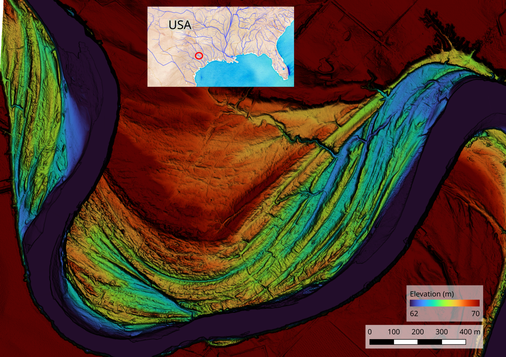

# ScrollStats

[![Actions Status][actions-badge]][actions-link]
[![Documentation Status][rtd-badge]][rtd-link]

[![PyPI version][pypi-version]][pypi-link]
[![Conda-Forge][conda-badge]][conda-link]
[![PyPI platforms][pypi-platforms]][pypi-link]

[![GitHub Discussion][github-discussions-badge]][github-discussions-link]

<!-- SPHINX-START -->

<!-- prettier-ignore-start -->
[actions-badge]:            https://github.com/tamu-edu/scrollstats/workflows/CI/badge.svg
[actions-link]:             https://github.com/tamu-edu/scrollstats/actions
[conda-badge]:              https://img.shields.io/conda/vn/conda-forge/scrollstats
[conda-link]:               https://github.com/conda-forge/scrollstats-feedstock
[github-discussions-badge]: https://img.shields.io/static/v1?label=Discussions&message=Ask&color=blue&logo=github
[github-discussions-link]:  https://github.com/tamu-edu/scrollstats/discussions
[pypi-link]:                https://pypi.org/project/scrollstats/
[pypi-platforms]:           https://img.shields.io/pypi/pyversions/scrollstats
[pypi-version]:             https://img.shields.io/pypi/v/scrollstats
[rtd-badge]:                https://readthedocs.org/projects/scrollstats/badge/?version=latest
[rtd-link]:                 https://scrollstats.readthedocs.io/en/latest/?badge=latest

<!-- prettier-ignore-end -->

An open-source python library to calculate and extract morphometrics from
scrollbar floodplains.

For further reading on the rationale behind ScrollStats and practical examples
demonstrating how to use ScrollStats, check out the documentation here:
https://scrollstats.readthedocs.io/en/latest

## Introduction
Scrollbar floodplains, often characterized by a series of low-lying,
gently sloping terraces, exhibit a distinct geomorphic signature that
can be found in high-resolution digital elevation models (DEMs). The
small elevation gradients and fine-scale topographic undulations
reflect the dynamic balance between sediment deposition and erosional
scouring associated with fluvial processes from the past. When rivers
migrate laterally, the resulting channels appear in DEMs as discrete,
V-shaped valleys. These channel geometries capture the history of
river migration and mechanisms. DEM-based analyses of scrollbar
floodplains provide critical insight into the temporal evolution of
channel morphology and the underlying hydrologic and sedimentary
controls that govern riverine landscape change.

The figure below is a visualization of the DEM of [a bend on the Lower Brazos River,
TX](https://www.google.com/maps/@30.614411,-96.499508,16z). We can
clearly see the undulations in the DEM caused by the river migration
as well as features such as cross-channels formed by water flow
through the floodplain.



## Getting Started

If you intend to use ScrollStats for your own analysis, follow the User
Installation instructions.

If you intend to develop or contribute to ScrollStats, follow the Developer
Installation instructions.

### User Installation

Install ScrollStats with `pip`

```shell
python -m pip install scrollstats
```

Or install with `conda`

```shell
conda install scrollstats
```

> NOTE: scrollstats v0.1.3 must be installed with python <=3.12 when using conda

### Developer Installation

First, clone the repo locally, create a virtual environment for the project,
then install the `[dev]` optional dependencies listed in
[pyproject.toml](pyproject.toml).

```shell
git clone https://github.com/tamu-edu/scrollstats

python -m venv venv/
source venv/bin/activate

(venv) python -m pip install -e ".[dev]"
```

## The ScrollStats Workflow

The ScrollStats Workflow can be broken up into the 3 major steps listed below.
Each of these steps is covered in detail in [docs](docs/) with code examples
using datasets generated from
[a bend on the Lower Brazos River, TX](https://www.google.com/maps/@30.614411,-96.499508,16z).

### 1. [Delineate Ridge Areas](docs/DelineateRidgeAreas.md)

Delineate ridge areas from a DEM to create the ridge area raster. This is
achieved by:

1. applying the profile curvature and residual topography transforms to the DEM
2. applying a threshold at 0 to these transformed rasters to create binary
   rasters
3. finding the union of these binary rasters
4. denoising the union raster

### 2. [Create Vector Datasets](docs/CreateVectorDatasets.md)

Create the following vector datasets to define key morphological features of the
bend.

- bend boundary
- packet boundaries
- channel centerline
- ridge lines
- migration pathways

Some of these datasets are digitized manually, while others are generated by
ScrollStats. Details of the vector data creation process can be found in the doc
linked above.

### 3. [Calculate Ridge Metrics](docs/CalculateRidgeMetrics.md)

Once all of the vector datasets are created and the raster areas are delineated,
you can now calculate ridge metrics across the entire bend.

These metrics include ridge amplitude, width, and migration distance for every
intersection of a ridge and migration pathway.

## Contributing

Contribution to ScrollStats is welcome. There will forever be a "frozen" branch
that contains the code exactly as it was at the time of publication, but it is
the intent of the maintainer to accept community feedback and suggestions to the
project.

**Submitting Feedback** To submit feedback, please open an issue on this
repository with the appropriate label. Currently used labels are:

- `documentation`: issues concerning the workflow or clarity of instructions
- `feature`: issues requesting or proposing new features for scrollstats
- `bug`: issues concerning errors in the code itself
