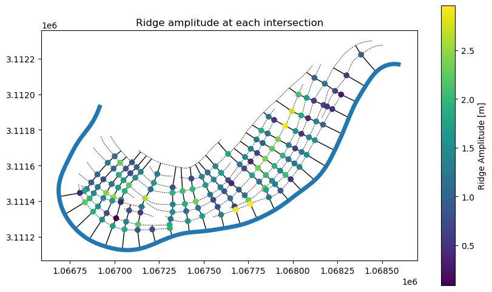

# Calculate Ridge Metrics

This notebook contains the code required to calculate ridge metrics from the
previously created datasets:

- Ridges
- Migration Pathways
- Packets
- Ridge Area Raster
- DEM

From these datasets, we will calculate ridge width, amplitude, and migration
distance at every ridge-transect intersection and plot ridge amplitude on a map.

## Output datasets

The `calculate_ridge_metrics` function takes the transects, ridges, clipped
ridge area (binary) and DEM rasters as input and returns two GeoDataFrames

- `rich transects`
- `itx points`

### Rich Transects

The `rich_transects` retain the same geometry as the input transects but have
the following additional fields:

- `r_000` ... `r_###`: the distance between the channel centerline and that
  ridge along the specified transect
- `dem_signal`: dem values sampled along the transect with 1m sampling
- `bin_signal`: binary raster values sampled along the transect with 1m sampling
- `ridge_count_raster`: the ridge count along the transect calculated from the
  number of unique ridges in `bin_signal`
- `fft_spacing`: the fft-derived dominant wavelength from `bin_signal` -
  corresponds to a representative spacing between ridges along the transect

### Intersection Points

The `itx` points are the collection of point intersections between the ridges
and transects. `itx` contains the three following ridge metrics in it's
attribute field:

- `pre_mig_dist`: the migration distance from the previous ridge. Also referred
  to as "ridge spacing"
- `ridge_width`: the width of the ridge derived from `bin_signal` measured in px
- `ridge_amp`: the amplitude of the ridge derived from `dem_signal` measured in
  units of the DEM

`itx` also contains the following fields:

- `start_distances`: the along-transect distance to the intersection point
- `transect_position`: vertex position of the intersection point along the
  transect
- `metric_confidence`: a simple metric derived from `bin_signal` describing the
  confidence in other ridge metrics.
- `relative_vertex_distances`: the relative along-transect distance of the
  substring that corresponds to the intersection. A relative vertex position of
  0.5 is at the exact midpoint of the transect.
- `vertex_indices`: the indices of the `dem_signal` or `binary_signal` of the
  transect that correspond to the location of the itx substring
- `dem_signal`: the section of the transect's `dem_signal` that corresponds to
  the itx substring
- `dem_signal_selection`: a subset of `dem_signal` if the intersection point is
  on the first ridge from the channel
- `bin_signal`: the section of the transect's `bin_signal` that corresponds to
  the itx substring
- `bool_mask`: `bin_signal` expressed as a boolean array
- `post_mig_dist`: the migration distance to the next ridge
- `pre_mig_time`: the difference in `deposit_year` between the intersected and
  previous ridge
- `post_mig_time`: the difference in `deposit_year` between the intersected and
  next ridge
- `pre_mig_rate`: `pre_mig_dist` / `pre_mig_time`
- `post_mig_rate`: `post_mig_dist` / `post_mig_time`
- `deposit_year`: `deposit_year` of the corresponding ridge
- `substring_geometry`: the `LineString` of the substring corresponding to the
  intersection
- `geometry`: the `Point` geometry of the intersection
- `swale_dq_adjustment`: values up to this index are removed from `dem_signal`,
  `bin_signal`, and `bool_mask` for calculations. This distance is preserved in
  the output for subsequent plotting and analysis

```python
from __future__ import annotations

from pathlib import Path

import geopandas as gpd
import matplotlib.pyplot as plt
import rasterio

from scrollstats import calculate_ridge_metrics
```

```python
# Set input/output paths
# Vector Datasets
ridge_path = Path("example_data/output/LBR_025_ridges_manual_smoothed.geojson")
transect_path = Path("example_data/output/LBR_025_transects.geojson")
packet_path = Path("example_data/input/LBR_025_packets.geojson")
centerline_path = Path("example_data/input/LBR_025_cl.geojson")

# Raster Datasets
bin_clip_path = Path("example_data/output/LBR_025_dem_ridge_area_raster.tif")
dem_clip_path = Path("example_data/output/LBR_025_dem_clip.tif")

# Output
output_dir = Path("example_data/output")
```

```python
# Read in datasets

# Vector Data
ridges = gpd.read_file(ridge_path)
transects = gpd.read_file(transect_path)
packets = gpd.read_file(packet_path)
cl = gpd.read_file(centerline_path)

# Raster Data
bin_raster = rasterio.open(bin_clip_path)
dem = rasterio.open(dem_clip_path)
```

```python
# Calculate ridge metrics
rich_transects, itx = calculate_ridge_metrics(transects, ridges, bin_raster, dem)
itx = itx.loc["LBR_025"]

# Join packet info
itx_w_packets = itx.sjoin(packets.drop("bend_id", axis=1))
itx_w_packets = itx_w_packets.reset_index().set_index(
    ["transect_id", "ridge_id", "packet_id"]
)
ridge_metrics_w_packets = itx_w_packets[["ridge_amp", "ridge_width", "pre_mig_dist"]]
ridge_metrics_w_packets.columns = ridge_metrics_w_packets.columns.rename("metrics")
```

```python
# Plot ridge amplitudes at intersections
# Plot itx
fig, ax = plt.subplots(1, 1, figsize=(10, 6))

ridges.plot(ax=ax, color="k", ls="--", lw=0.5, zorder=0)
transects.plot(ax=ax, color="k", lw=1, zorder=1)
cl.plot(ax=ax, color="tab:blue", lw=5, zorder=2)

itx_w_packets.plot(
    column="ridge_amp",
    ax=ax,
    zorder=2,
    legend=True,
    legend_kwds={"label": "Ridge Amplitude [m]"},
)

ax.set_title("Ridge amplitude at each intersection")
```


