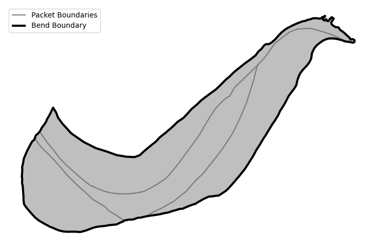
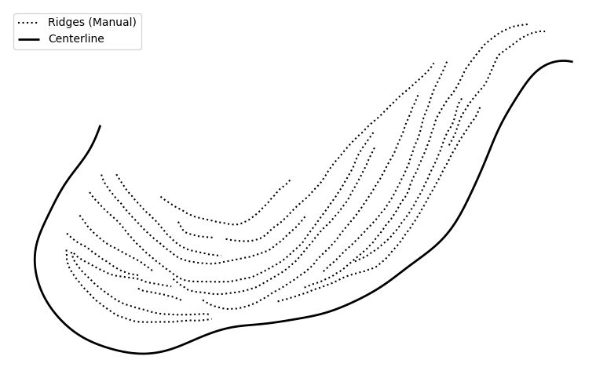
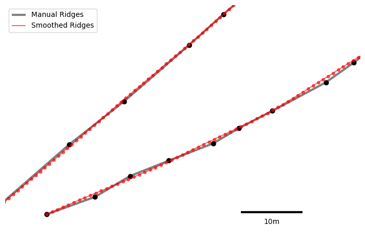
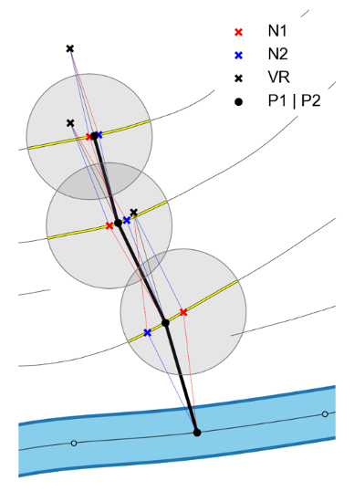
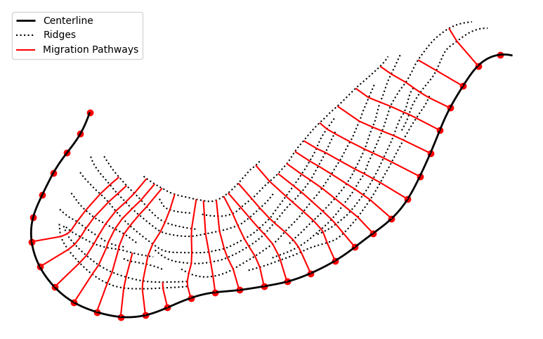

# Create Vector Datasets

This notebook contains general instructions for the creation of the vector data
sets required by ScrollStats.

An example dataset of a bend from the Lower Brazos River, Texas, is included in
this notebook to provide a visual aid to the user when creating datasets for
their own bend.

Some datasets need to be manually created while others are programmatically
generated from the manually created datasets.

---

ScrollStats uses the following vector datasets for a bend in order to calculate
ridge metrics:

- **Channel Centerline (LineString):**
  - The channel centerline polyline should not intersect the bend boundary
    polygon at all and should extend past inner bank of the bend boundary by 1-2
    channel widths.
- **Bend Boundary (Polygon):**
  - The bend boundary in this case defines the boundary encompasses the raised
    platform of ridge and swale topography between the active channel and the
    relatively smooth ancestral floodplain. Each bend boundary should have a
    corresponding bend_id that can be used to relate data together. For example,
    the 25th bend on the Lower Brazos River was given the beind_id `LBR_025`.
- **Packet Boundaries (Polygon):**
  - The packet boundaries are polygons that fit perfectly within, and cover
    entirely, the bend boundary polygons. Packet boundaries encompass groups of
    ridges with similar trajectories. Packet boundaries should have `bend_id`
    column as well as a `packet_id` column. The `bend_id` can be used as a
    foreign key to relate the packets to their bend and the simple `packet_id`
    (ex. `p_01`) can be used to diffferentiate the packets within each bend.
    There is no guarantee of an inherent order with packets, but in general,
    they can and should be numbered incrementally from the most ancestral to the
    most recent.
- **Ridges (LineString):**
  - Ridges are manually created for each ridge on the bend. Ridge polylines can
    be created before the raster ridge classification process, however it is
    recommended that the binary ridge area rasters be used to help inform the
    creation of ridge polylines. Ridge polylines should have a `bend_id` column,
    a `ridge_id` column, and optionally a `packet_id` column if packets are
    used. The `bend_id` and optional `packet_id` columns can be used as foreign
    keys to relate ridges to the larger morphological features and the simple
    `ridge_id` (ex. `r_001`) can be used to differentiate ridges within a bend.
    To a greater degree than the packets, there is no guarantee of an inherent
    order to the ridges on a given bend. However, as seen in the accompanying
    manuscript, ridges often can, but are not guaranteed to, be ordered within
    packets.
- **Migration Pathways (LineString):**
  - Migration pathways are algorithmically generated from the channel centerline
    and a set of ridges. The user specifies a set of starting points along the
    centerline from which the migration pathways will be generated. The
    migration pathway algorithm will "walk" up the flood plain until it fails to
    intersect any more ridges. The resulting migration pathways represent the
    varied paths of migration along a bend according to the depositional record
    contained in the ridge and swale topography

**Note on point density for channel centerline and ridgelines**

> A high vertex density and high degree of "smoothness" are necessary for both
> the channel centerline and ridge lines when creating the migration pathways.
> It is recommended that you focus on capturing the overall ridge form, not
> point density, when delineating. Then, the coarse polylines can be densified
> and smoothed with the included [LineSmoother](scrollstats.LineSmoother) class.

---

While all of these above datasets are used, not all are strictly necessary, not
all are required at the beginning of the workflow, and some are generated from
ScrollStats.

The details of use for each of these datasets are summarized below:

**Required for Raster Processing**:

- Bend Boundary: the bend boundary is a required input from the user and is
  required for the raster processing. The bend boundary is the manual
  delineation of the topographically raised platform that conatians the ridge
  and swale topography of a bend.

**Required for Migration Pathway Creation**

- Channel Centerline: the channel centerline generally follows the path of the
  water surface and should not intersect the bend boundary at all. The channel
  centerline should also extend past the channel-ward edges of the bend
  boundary. _See note at the end of this cell on point density for channel
  centerline and ridge lines._

- Ridges: ridges are manually created and should track the middle of each ridge
  area. While it is not necessary, it's strongly recommended that both the DEM
  and ridge area raster be used to infer ridge line locations. _See note at the
  end of this cell on point density for channel centerline and ridge lines._

**Used for ridge metric calculation**

- Migration Pathways: migration pathways are created by ScrollStats, so the user
  does not need to worry about creating these as an input. Migration pathways
  are a series of transects that trace the supposed path of channel migration
  from the channel centerline. Migration pathways are used to sample both the
  DEM and ridge area raster to calculate ridge width, amplitude, and spacing for
  every point intersection of the migration pathways and ridge lines.

- Packet Boundaries (optional): packet boundaries are the manual delineations of
  the depositional packets within a bend that contain groups of ridges with
  similar trajectorties. Packet boundaries fit perfectly within and cover
  entirely the bend boundary. Providing packet boundaries gives allows the user
  to aggregate ridge metrics to the packet scale in order to investigate changes
  in the hydrologic regime of the river.

## Create Bend Boundaries

Use a desktop GIS software (QGIS, ArcGIS Pro, etc.) to manually delineate the
bend boundaries.

If there multiple bends delineated for the same river, it is recommended to make
1 layer for the entire river and just add each bend as a feature (row) for that
layer. Additionally, each bend should have a short, unique ID that is shared
with the DEMs. For example, the 25th bend along the Lower Brazos River (starting
from Waco TX) is given the ID `LBR_025`.

At this stage, it is recommended to create the optional packet boundaries as
well. Similarly to the bend boundaries, it is recommended to make one layer for
all the packets in the river and just add each packet as a feature (row). Add a
"bend_id" column and a "packet_id" column. The bend id should correspond to the
bend_id of the encompassing boundary and it is recommended to have use a simple
incrementing packet id that corresponds to the apparent evolution of the bend.
For example, the most ancestral packet of `LBR_025` has the packet_id of `p_01`
and the most recent, channelward packet has a packet_id of `p_04`. The
combination of the bend_id and packet_id columns forms the primary key for the
packets.

Example bend and packet boundaries can be found in the
[example_data](https://github.com/tamu-edu/scrollstats/tree/main/example_data)
directory included with ScrollStats. These boundaries are mapped below.

```python
from __future__ import annotations

from pathlib import Path

import geopandas as gpd
import matplotlib.pyplot as plt
import numpy as np
from shapely.geometry import MultiPoint

from scrollstats import LineSmoother, create_transects

# User defined parameters
# LineSmoother
SMOOTHING_WINDOW_SIZE = 5  # Measured in vertices
VERTEX_SPACING = 1  # Distance between densified vertices; Measured in linear unit of dataset (meters for example datasets)

# Migration Pathway
SHOOT_DISTANCE = 300  # Distance that the N1 coordinate will shoot out from point P1; measured in linear unit of dataset
SEARCH_DISTANCE = 200  # Buffer radius used to search for an N2 coordinate on R2; measured in linear unit of dataset
DEV_FROM_90 = 5  # Max angular deviation from 90° allowed when searching for an N2 coordinate on R2; measured in degrees
```

```python
bend_area = gpd.read_file("example_data/input/LBR_025_bend.geojson").set_index(
    "bend_id"
)
packets = gpd.read_file("example_data/input/LBR_025_packets.geojson").set_index(
    "packet_id"
)

fig, ax = plt.subplots(1, 1, figsize=(10, 6))

packets.boundary.plot(color="grey", ax=ax, label="Packet Boundaries")
packets.plot(color="grey", alpha=0.5, ax=ax)
bend_area.boundary.plot(color="k", lw=3, ax=ax, label="Bend Boundary")

ax.legend(loc="upper left")
ax.set_axis_off()
```



## Create Channel Centerline and Ridgelines

After the ridge area rasters are created, manually create the ridge lines and
channel centerlines.

Example centerline and ridgelines can be found in the
[example_data](https://github.com/tamu-edu/scrollstats/tree/main/example_data)
directory included with ScrollStats. The centerline and ridgelines are mapped
below.

```python
ridge_path = Path("example_data/input/LBR_025_ridges_manual.geojson")
manual_ridges = gpd.read_file(ridge_path)

# Centerline is already smoothed and densified
cl_path = Path("example_data/input/LBR_025_cl.geojson")
cl = gpd.read_file(cl_path)

# Plot
fig, ax = plt.subplots(1, 1, figsize=(10, 6))

manual_ridges.plot(color="k", ls=":", ax=ax, label="Ridges (Manual)")
cl.plot(color="k", lw=2, ax=ax, label="Centerline")

ax.legend(loc="upper left")
ax.set_axis_off()
```



### Line Smoothing

Apply `LineSmoother` to smooth and densify the lines

```python
# Smooth and densify the lines
ls = LineSmoother(manual_ridges, VERTEX_SPACING, SMOOTHING_WINDOW_SIZE)
smooth_ridges = ls.execute()

# Save smooth ridges to disk
output_dir = Path("example_data/output")
smooth_ridge_name = ridge_path.with_stem(ridge_path.stem + "_smoothed").name
smooth_ridge_path = output_dir / smooth_ridge_name

smooth_ridges.to_file(smooth_ridge_path, driver="GeoJSON", index=False)

# Plot manual and smoothed ridges
fig, ax = plt.subplots(1, 1, figsize=(10, 6))
ax.set_aspect("equal")

manual_ridges_points = manual_ridges.geometry.apply(lambda x: MultiPoint(x.coords))
smooth_ridges_points = smooth_ridges.geometry.apply(lambda x: MultiPoint(x.coords))

manual_ridges.plot(ax=ax, color="grey", lw=3, zorder=1, label="Manual Ridges")
manual_ridges_points.plot(ax=ax, color="black", markersize=40, zorder=2)
smooth_ridges.plot(
    ax=ax, color="red", lw=1.5, alpha=0.6, zorder=3, label="Smoothed Ridges"
)
smooth_ridges_points.plot(ax=ax, color="red", markersize=15, alpha=0.6, zorder=4)

# scalebar
x_sb = 1067860
y_sb = 3111455
len_sb = 10
ax.plot((x_sb, x_sb + len_sb), (y_sb, y_sb), lw=3, color="black")
ax.text(x=x_sb + len_sb / 2, y=y_sb - 2, s=f"{len_sb}m", horizontalalignment="center")

ax.set_ylim(3111450, 3111490)
ax.set_xlim(1067820, 1067880)
ax.legend(loc="upper left")
ax.set_axis_off()
```



## Create Migration Pathways

Now that the ridges and centerlines are created, we can create the migration
pathways

A migration pathway can be created from any point along the centerline. Below we
will create an array of starting points each roughly a channel-width apart
(~100m for the Lower Brazos).

You can also create a set number of starting points by defining your `step`
distance as the channel length divided by the number of evenly spaced transects.

### Migration Pathway Algorithm

Our process involves ten major steps as follows:

1. Let the channel centerline be called R1
2. Select a starting point on R1, let this point be called P1
3. From P1, shoot a given distance perpendicular from R1 in the direction of the
   convex bank.
4. If the line intersects a ridge line, call this ridge R2 and proceed to
   step 5. If not, move on to the next location on R1 and repeat step 2.
5. Where this new line intersects R2, make a new point and call it N1
6. Buffer N1 by a given radius and search all vertices of R2 that intersect this
   buffer for a point from which a line may be drawn back to P1 that is
   perpendicular to R2. Call this new point on R2, N2.
7. Treating the lines P1->N1 and P1->N2 as vectors, calculate their vertical
   resultant and place a new point at the end of this vertical resultant. Let
   this point be called VR.
8. Where the line P1->VR intersects R2, place a point and let this point be
   called P2. Line P1->P2 is the migration pathway for this location on the
   floodplain.
9. Redefine P2 as P1
10. Repeat steps 3-9 until the perpendicular shot from P1 fails to intersect any
    ridges.



```python
# define the distance between transects
step = 100

# With a vertex spacing of ~1m, take every `step`th vertex along the centerline
starts = np.asarray(cl.geometry[0].xy).T[::step]

# Generate transects
transects = create_transects(
    cl, smooth_ridges, step, SHOOT_DISTANCE, SEARCH_DISTANCE, DEV_FROM_90
)

# Save transects to disk
transect_path = output_dir / "LBR_025_transects.geojson"
transects.to_file(transect_path, driver="GeoJSON", index=True)

# Plot migration pathways alongside ridges and centerlines
fig, ax = plt.subplots(1, 1, figsize=(10, 6))

cl.plot(color="k", lw=2, ax=ax, label="Centerline")
smooth_ridges.plot(color="k", ls=":", ax=ax, label="Ridges")
transects.plot(color="r", ax=ax, label="Migration Pathways")
plt.scatter(starts[:, ::2], starts[:, 1::2], color="r")

ax.legend()
ax.set_axis_off()
```



## Move on to [Calculate Ridge Metrics](CalculateRidgeMetrics.md)

All vector datasets needed for ScrollStats are now created.
[Calculate Ridge Metrics](CalculateRidgeMetrics.md) will contain the example
code to calculate ridge metrics from the ridges generated in this notebook and
the ridge area raster created in [Delineate Ridge Areas](DelineateRidgeAreas.md)
