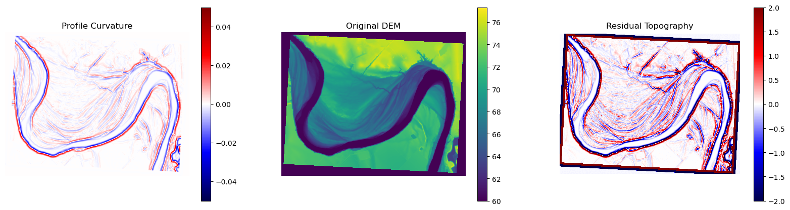
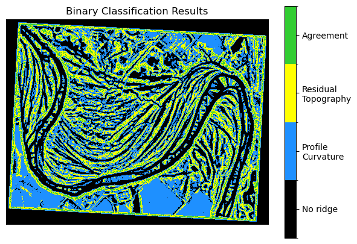
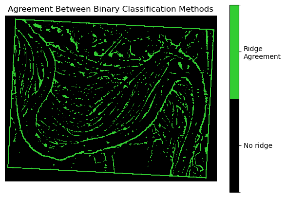
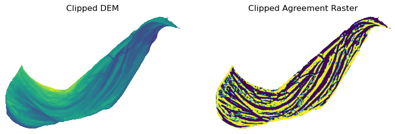
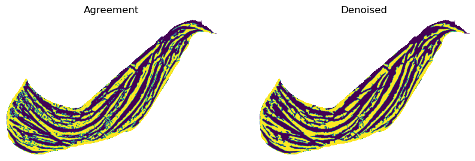

# Delineate Ridge Areas

This section demonstrates how ScrollStats delineates ridge areas from an input
DEM.

Ridge area delineation is accomplished with the following operations:

1. apply profile curvature and residual topography transformations
2. apply binary classification to the transformed rasters
3. find the agreement between the binary rasters
4. denoise the agreement raster

## Convenience Functions

The steps above to create what's called the _ridge area raster_ are all
performed in the two following convenience functions:

- `create_ridge_area_raster`
- `create_ridge_area_raster_fs`

**`create_ridge_area_raster`** takes a `rasterio.DatasetReader` of the DEM, a
shapely `Polygon` of the bend area and any other kwargs as input and returns two
`np.ndarray` objects (the clipped ridge area raster and clipped DEM) and the
modified `rasterio` metadata to write the arrays to disk if needed

```python
import rasterio
import geopandas as gpd
import numpy as np

from scrollstats import create_ridge_area_raster

# User provided parameters
RASTER_WINDOW_SIZE = 45  # kernel size for image processing; measured in px
SMALL_FEATS_SIZE = (
    500  # all features smaller will be removed in denoising process; measured in px^2
)

# Input Dataset Paths
dem_path = Path("example_data/input/LBR_025_dem.tif")
bend_path = Path("example_data/input/LBR_025_bend.geojson")

# Read in the DEM
dem_ds = rasterio.open(dem_path)

# Read in the bend area as a GeoDataFrame; then get the Polygon geometry
bend = gpd.read_file(bend_path)
bend_geom = bend.loc[0, "geometry"]

agr_clip, dem_clip, clip_meta = create_ridge_area_raster(
    dem_ds=dem_ds,
    geometry=bend_geom,
    no_data=np.nan,
    window=RASTER_WINDOW_SIZE,
    dx=1,
    small_feats_size=SMALL_FEATS_SIZE,
)
```

**`create_ridge_area_raster_fs`** is just a wrapper for
`create_ridge_area_raster` taking and returning file paths to act as an
interface for the file system

```python
from pathlib import Path
import numpy as np
from scrollstats import create_ridge_area_raster_fs

# User provided parameters
RASTER_WINDOW_SIZE = 45  # kernel size for image processing; measured in px
SMALL_FEATS_SIZE = (
    500  # all features smaller will be removed in denoising process; measured in px^2
)

# Set paths to datasets on the file system
dem_path = Path("example_data/input/LBR_025_dem.tif")
bend_path = Path("example_data/input/LBR_025_bend.geojson")
output_dir = Path("example_data/output")

binary_path_out, dem_path_out = create_ridge_area_raster_fs(
    dem_path=dem_path,
    geometry_path=bend_path,
    out_dir=output_dir,
    no_data=np.nan,
    window=RASTER_WINDOW_SIZE,
    dx=1,
    small_feats_size=SMALL_FEATS_SIZE,
)
```

## Detailed Breakdown

> NOTE: this section breaks down how scrollstats accomplishes the 4 main steps
> listed at the top of the page. However, this is just for illustration. The
> convenience functions described above should be used to create the ridge area
> raster.

### 1. Calculate Profile Curvature and Residual Topography

ScrollStats uses Profile Curvature (a measure of convexity) and Residual
Topography (a measure of prominence) to identify ridge areas in the DEM.

Both of these transformations can be classified into "ridge" and "not ridge"
areas by applying a threshold at 0, creating a binary raster. Using two
independent classifications to identify ridge areas, we can be confident that
the union of these two binary rasters represent the true ridge locations within
the DEM.

```python
from functools import partial
from pathlib import Path

import geopandas as gpd
import matplotlib.pyplot as plt
import numpy as np
import rasterio
from matplotlib.colors import BoundaryNorm, ListedColormap
from scipy import ndimage

from scrollstats.delineation import (
    create_ridge_area_raster,
    create_ridge_area_raster_fs,
)
from scrollstats.delineation.raster_classifiers import (
    quadratic_profile_curvature,
    residual_topography,
)
from scrollstats.delineation.raster_denoisers import remove_small_feats_w_flip
from scrollstats.delineation.ridge_area_raster import clip_raster

# Input Paths
dem_path = Path("example_data/input/LBR_025_dem.tif")
bend_path = Path("example_data/input/LBR_025_bend.geojson")

# Output Directory
output_dir = Path("example_data/output")

# User provided parameters
RASTER_WINDOW_SIZE = 45  # kernel size for image processing; measured in px
SMALL_FEATS_SIZE = (
    500  # all features smaller will be removed in denoising process; measured in px^2
)
```

```python
# Open the DEM dataset
dem_handle = rasterio.open(dem_path)
dem = dem_handle.read(1)

# Find no data pixels
if np.isnan(dem_handle.nodata):
    no_data_mask = np.isnan(dem_handle.read(1))
else:
    no_data_mask = dem == dem_handle.nodata

# Set no data values to absurd integer to avoid errors from the classifier functions with infinite values
dem[no_data_mask] = -99999

# Calculate the transformation rasters
profc = quadratic_profile_curvature(dem, RASTER_WINDOW_SIZE, dx=1)
rt = residual_topography(dem, RASTER_WINDOW_SIZE)

# Plot
fig, (ax1, ax2, ax3) = plt.subplots(1, 3, figsize=(20, 5))

mapper = ax1.imshow(profc, vmin=-0.05, vmax=0.05, cmap="seismic")
fig.colorbar(mapper, ax=ax1)
ax1.set_axis_off()
ax1.set_title("Profile Curvature")

mapper = ax2.imshow(dem, vmin=60)
fig.colorbar(mapper, ax=ax2)
ax2.set_axis_off()
ax2.set_title("Original DEM")

mapper = ax3.imshow(rt, vmin=-2, vmax=2, cmap="seismic")
fig.colorbar(mapper, ax=ax3)
ax3.set_axis_off()
ax3.set_title("Residual Topography")
```



### 2. Apply Binary Classification

First, apply a threshold at 0 to each of the transform rasters. If the pixel
value is greater than 0, assign it a value of 1 (ridge). If the value is less
than or equal to 0, assign it a value of 0 (not-ridge)

```python
# classify each transformed raster from step 1
profc_bc = profc > 0
rt_bc = rt > 0

# Plot the classification results
## 00 - no ridge
## 01 - profile curvature
## 10 - residual topography
## 11 - both
profc_vis = np.zeros(profc.shape)
profc_vis[profc_bc] = 1

rt_vis = np.zeros(rt_bc.shape)
rt_vis[rt_bc] = 10

comp_vis = profc_vis + rt_vis

fig, ax = plt.subplots(1, 1, figsize=(7, 5))
cmap = ListedColormap(["k", "dodgerblue", "yellow", "limegreen"])
bounds = np.array([0, 1, 10, 11, 12])
norm = BoundaryNorm(bounds, cmap.N)
img = ax.imshow(comp_vis, cmap=cmap, norm=norm)
ax.set_axis_off()
ax.set_title("Binary Classification Results")

cbar = plt.colorbar(img)
cbar.set_ticks([0.5, 5.5, 10.5, 11.5], minor=False)
cbar.ax.set_yticklabels(
    ["No ridge", "Profile\nCurvature", "Residual\nTopography", "Agreement"]
)
```



### 3. Find agreement between the two binary rasters

Create the agreement raster as the union of the two binary rasters.

```python
# Find the union of the two binary rasters
agr = profc_bc & rt_bc

# Plot
fig, ax = plt.subplots(1, 1, figsize=(7, 5))
cmap = ListedColormap(["k", "limegreen"])
bounds = np.array([0, 1, 2])
norm = BoundaryNorm(bounds, cmap.N)
img = ax.imshow(agr, cmap=cmap, norm=norm)
ax.set_axis_off()
ax.set_title("Agreement Between Binary Classification Methods")

cbar = plt.colorbar(img)
cbar.set_ticks([0.5, 1.5], minor=False)
cbar.ax.set_yticklabels(["No ridge", "Ridge\nAgreement"])
```



Then clip the agreement raster with the bend polygon. This greatly reduces the
number of features before denoising the output in step 4.

```python
bend = gpd.read_file(bend_path)
bend_geom = bend.loc[0, "geometry"]

# Clip the DEM and agreement raster by assigning all pixels outside the bend geometry to np.nan
dem_clip, dem_mask, dem_meta = clip_raster(dem_handle, bend_geom, no_data=np.nan)
agr_clip, agr_mask, agr_meta = clip_raster(
    dem_handle, bend_geom, array=agr, no_data=np.nan
)

# Plot
fig, (ax1, ax2) = plt.subplots(1, 2, figsize=(10, 6))

mapper = ax1.imshow(dem_clip)
ax1.set_axis_off()
ax1.set_title("Clipped DEM")

agr_clip_vis = agr_clip.astype(float)
agr_clip_vis[agr_mask] = np.nan

mapper = ax2.imshow(agr_clip_vis)
ax2.set_axis_off()
ax2.set_title("Clipped Agreement Raster")
```



### 4. Denoise the agreement raster

Apply binary opening and closing operations to remove very small (approximately
single pixel width) features then remove all other small features with a
contiguous pixel count less than a given size.

```python
denoiser_funcs = [
    ndimage.binary_closing,
    ndimage.binary_opening,
    partial(remove_small_feats_w_flip, small_feats_size=SMALL_FEATS_SIZE),
]

# Denoise the binary array
ridge_area_array = agr_clip.copy()
for func in denoiser_funcs:
    ridge_area_array = func(ridge_area_array)

# Plot
fig, (ax1, ax2) = plt.subplots(1, 2, figsize=(10, 6))

mapper = ax1.imshow(agr_clip_vis)
ax1.set_axis_off()
ax1.set_title("Agreement")

ridge_area_array_vis = ridge_area_array.astype(float)
ridge_area_array_vis[agr_mask] = np.nan
mapper = ax2.imshow(ridge_area_array_vis)
ax2.set_axis_off()
ax2.set_title("Denoised")
```



## Move on to [Create Vector Datasets](CreateVectorDatasets.md)

[Create Vector Datasets](CreateVectorDatasets.md) will walk through the
processes and rationale for creating the vector datasets needed for ScrollStats.
The ridge area raster created from this process will be used later.
