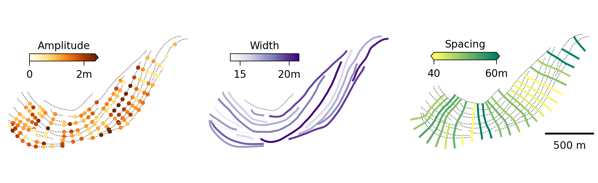

# ScrollStats

Welcome to the ScrollStats documentation.

[ScrollStats](https://github.com/tamu-edu/scrollstats) is an open-source Python
tool to quantify the morphology of scroll bars preserved in the ridge and swale
topography found in the floodplains of meandering rivers.

This quantification is accomplished by first generating a series of migration
pathways, based on the geometric methods described by
[Hickin 1974](https://doi.org/10.2475/ajs.274.4.414), that trace channel
migration across a river bend based on the orientation of preserved ridges in
the floodplain.

These migration pathways are then used to sample a DEM and other derived
topgraphic raster data to create a series of 1 dimensional signals from which
the ridge morphometrics of amplitude, width, and spacing can be calculated for
every intersection of a ridge and migration pathway.

The intersections of ridge and migration pathway form a geomorphically relevant
grid across which these metrics can be aggregated and analyzed longitudinally or
laterally relative to the channel.



_Figure 1: Measures of ridge amplitude (orange), width (purple), and spacing
(green) are shown at the intersection, ridge, and migration pathway scales.
Aggregate values represent the medain value of each measurement taken at a ridge
or migration pathway_

## The ScrollStats Workflow

The ScrollStats Workflow can be broken up into the 3 major steps listed below.
Each of these steps is covered in detail in Example Workflow docs (linked below
and in table of contents) with code examples using datasets generated from
[a bend on the Lower Brazos River, TX](https://www.google.com/maps/@30.614411,-96.499508,16z).

### 1. [Delineate Ridge Areas](DelineateRidgeAreas.md)

Delineate ridge areas from a DEM to create the ridge area raster. This is
achieved by:

1. applying the profile curvature and residual topography transforms to the DEM
2. applying a threshold at 0 to these transformed rasters to create binary
   rasters
3. finding the union of these binary rasters
4. denoising the union raster

### 2. [Create Vector Datasets](CreateVectorDatasets.md)

Create the following vector datasets to define key morphological features of the
bend.

- bend boundary
- packet boundaries
- channel centerline
- ridge lines
- migration pathways

Some of these datasets are digitized manually, while others are generated by
ScrollStats. Details of the vector data creation process can be found in the doc
linked above.

### 3. [Calculate Ridge Metrics](CalculateRidgeMetrics.md)

Once all of the vector datasets are created and the raster areas are delineated,
you can now calculate ridge metrics across the entire bend.

These metrics include ridge amplitude, width, and migration distance for every
intersection of a ridge and migration pathway.

```{toctree}
:maxdepth: 2
:hidden:
:caption: Example Workflow

DelineateRidgeAreas
CreateVectorDatasets
CalculateRidgeMetrics
CompleteScrollStatsWorkflow
```

```{toctree}
:maxdepth: 2
:hidden:
:caption: API

api/scrollstats
```

## Indices and tables

- {ref}`genindex`
- {ref}`modindex`
- {ref}`search`
